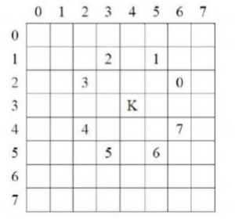
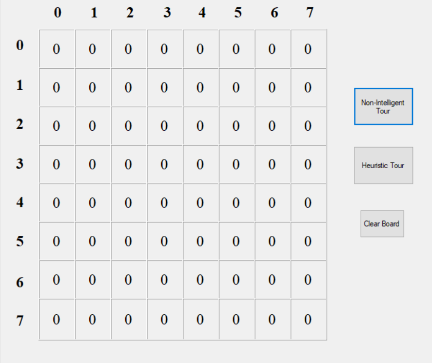
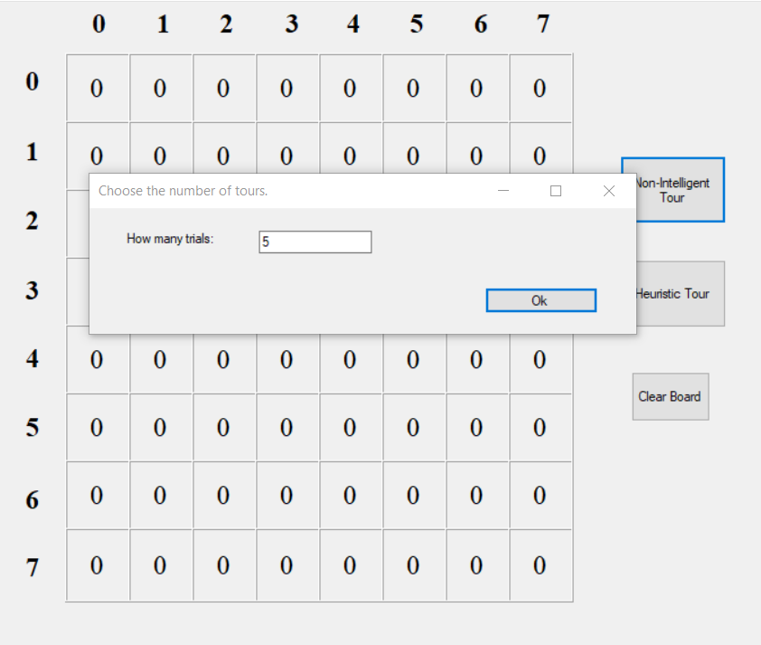
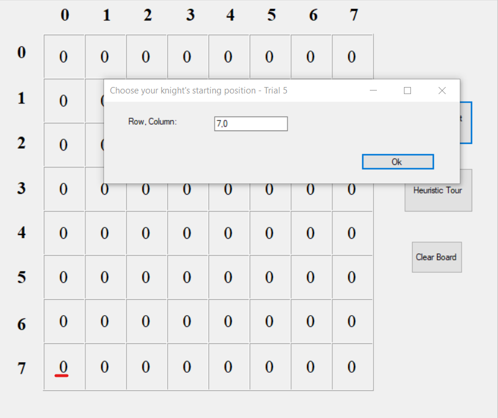
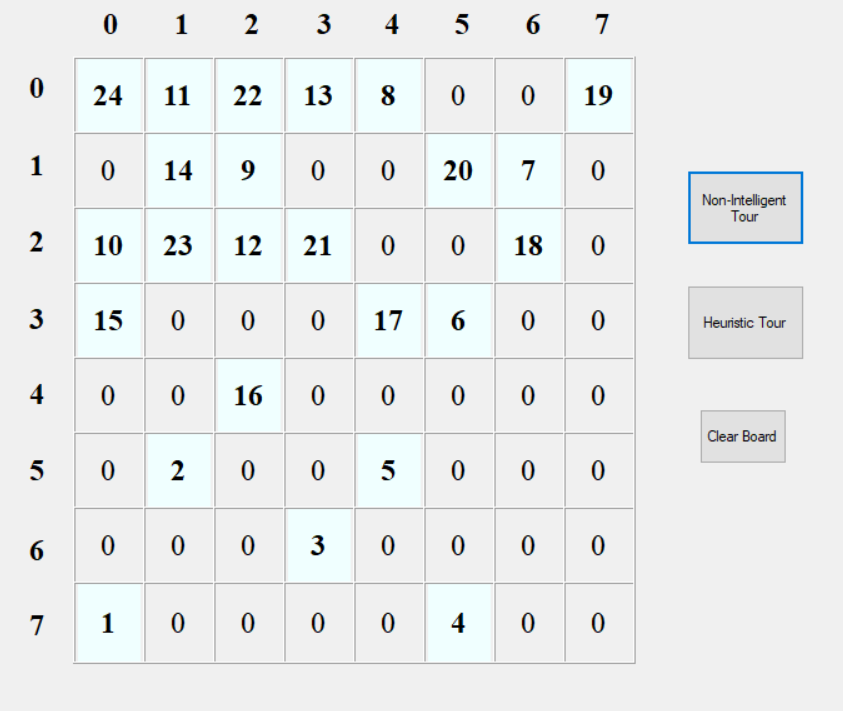
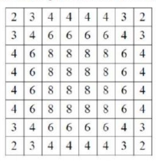
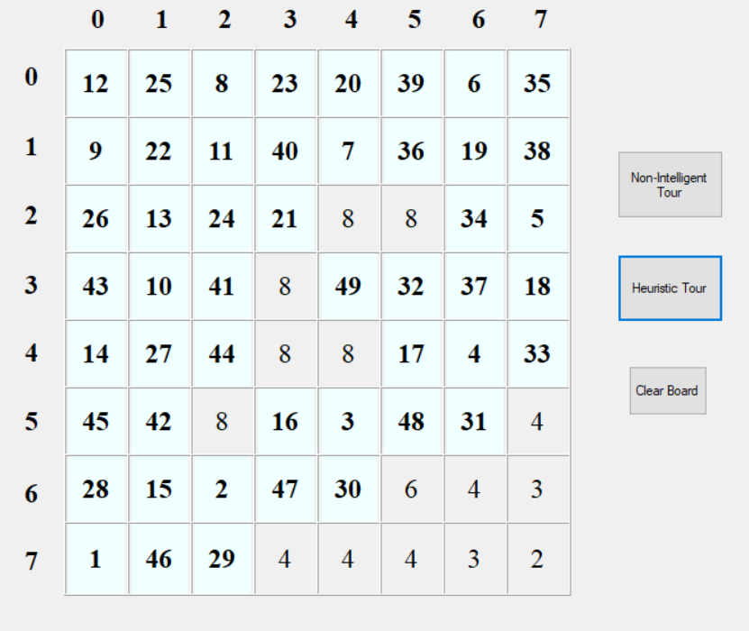
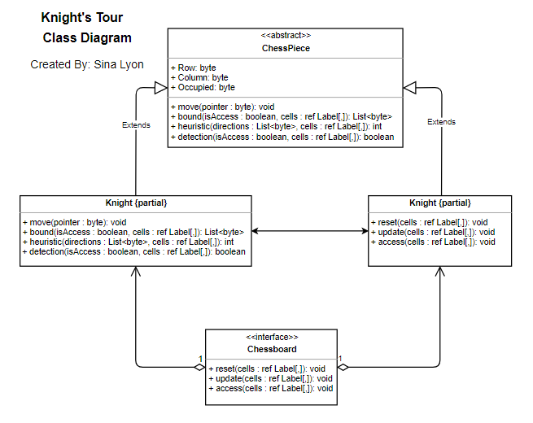
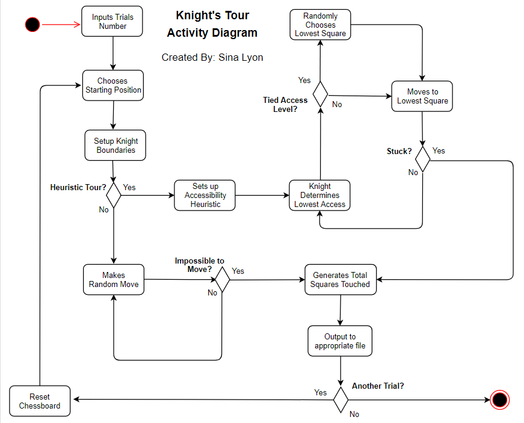

# Knights-Tour
This windows form program solves the Knight's Tour challenge, originally proposed by the mathematician Euler, which involves going to as many available squares on the chessboard as possible without being placed on the same square twice using the knight's L-shaped movment.

There are 8 possible movements shown below that the program detects through integers, K being the knight himself.

Below is the starting chessboard in the Windows Form application I developed using the .NET Framework.

As you can see, there's two types of tours you can run as well as an option to clear the board after a Knight's Tour has been executed.

Both tours start out with asking the user how many trials they'd like to see before the knight stops it's tour.

After selecting the number of trials, for each trial to be executed you must state the starting position of the Knight as shown below. We'll use position (7,0) to start at the bottom-left corner of the chessboard below.

## Non-intelligent version using random moves
The simple version of the Knight's Tour challenge is to just run a few trials at random and count how many squares the knight was able to be placed on until it can't move anymore. Each square the knight touches will be marked by an increasing number.

For example, we chose position (7,0) so the result in this case would be somewhat different every tour.

## Heuristic version with accessibility matrix
This algorithm is able to spot access levels of the chessboard using numbers from 2 to 8. For example: access level 2 would be the corner squares of the chessboard because they are the hardest to move on and access level 8 are the middle squares since the Knight piece can be placed in all of it's potential moves. The program would go for the level 2 corners first in order to be able to cover more squares.

Below is an image of what squares have which levels. The program will move to the hardest access level detected within the knight's reach.

Going back to the position we chose earlier being (7,0), the following image shows the Knight's Tour following the accessibility matrix as a guide. Note that this result will always be the same for position (7,0) since it's not random positioning.

## UML Designs

### Class Diagram 

### Activity Diagram

